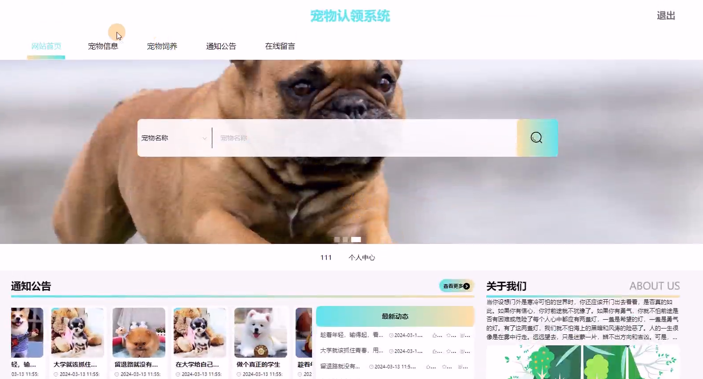
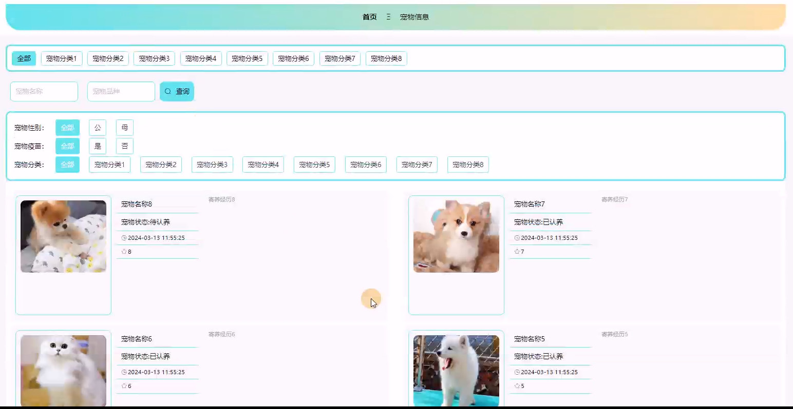
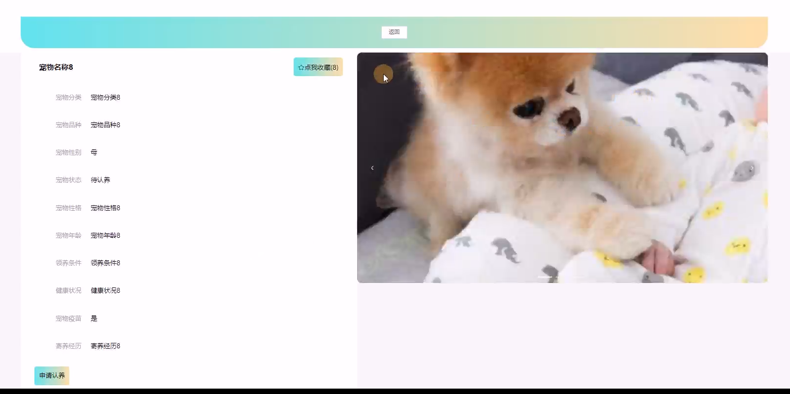
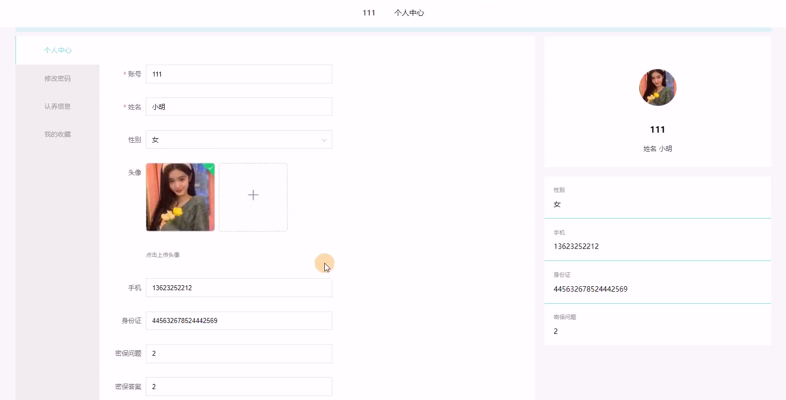
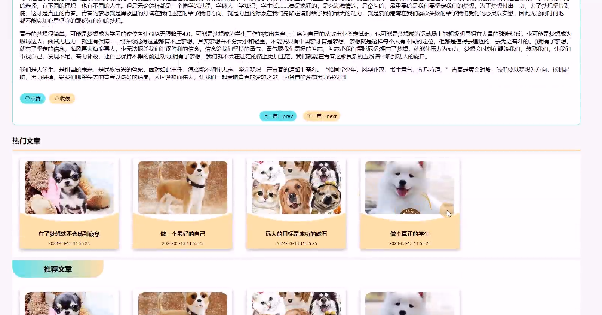
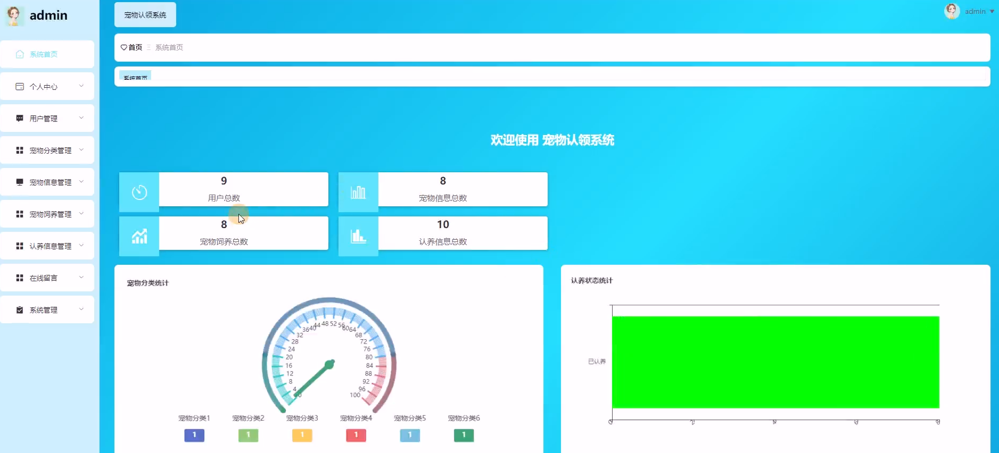
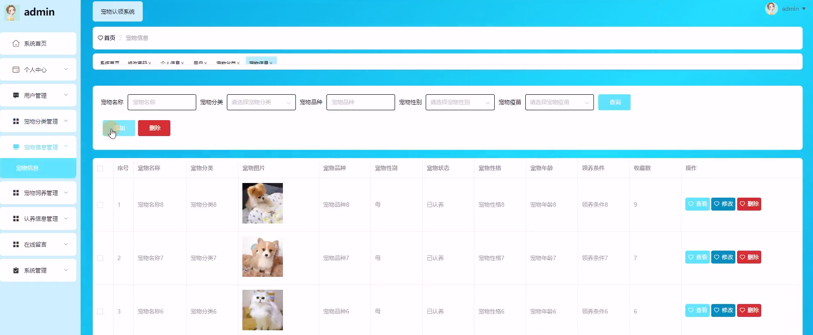
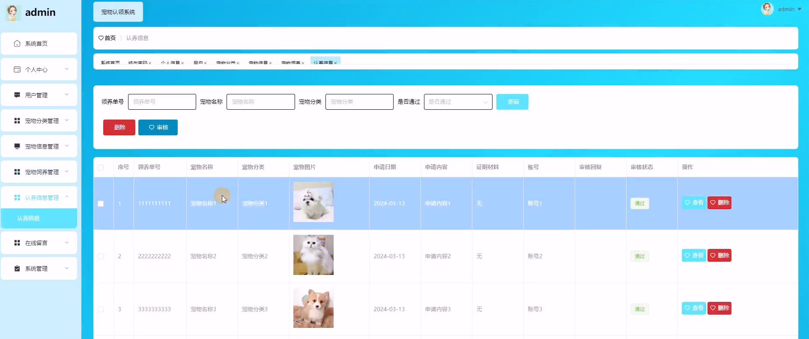
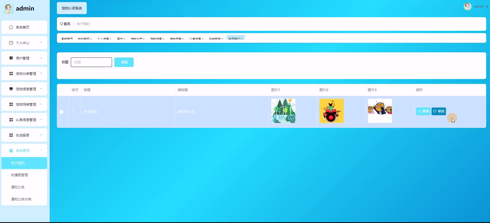
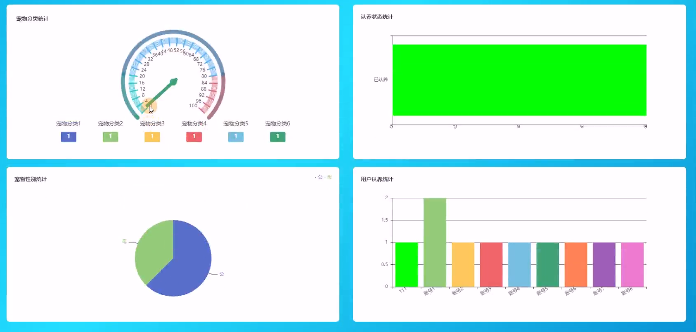

## 介绍
&emsp;&emsp;宠物认领、宠物领养，宠物救助，基于SpringBoot的宠物救助及领养系统，具体功能如下图所示。

> 1. 后端技术：SpringBoot+MyBatis-Plus
> 2. 前端技术：Vue
> 3. 数据库：MySQL
> 4. 软件：IDEA/Ecilpse
> 5. **3119403249**

##  系统展示

&emsp;

#### 系统首页

> 导航栏、搜索栏、通知公告、关于我们、在线留言等。

#### 宠物列表

> 按类查询、按品种查询、搜索名称等。

#### 宠物详情

> 宠物的详细信息，申请认领。

#### 个人中心

> 个人信息编辑、修改密码、认领信息、收藏等。

#### 通知公告

> 通知公告，同时展示热门文章和推荐文章。

#### 后台首页

> 可视化组件。

#### 宠物管理

> 管理员对宠物信息管理。

#### 认领管理

> 审核认领。

#### 系统管理

> 管理员管理系统信息。

#### 图形展示

